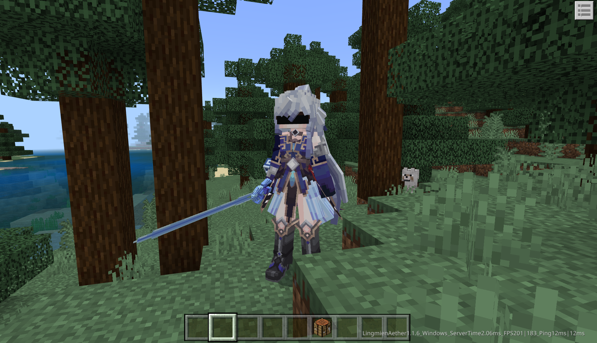
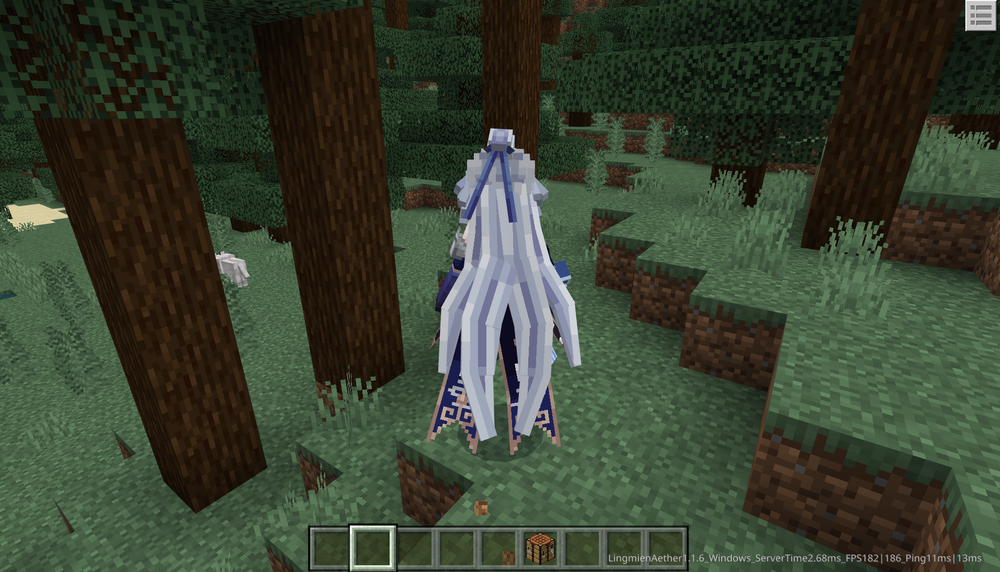

----
tips: 请使用md编译器或python charm打开本md文件更加便于阅读。
----

# PlayerRender
> - 点此阅读[灵免以太文档](http://www.dafeimian.com/docs/LingmienAether)
> - 点此阅读[GitHub]项目仓库(https://github.com/DaFeimian/PlayerRender)
> - 单独运行没有效果，需要灵免以太测试环境

我的世界中国基岩版自定义玩家渲染[jingliu.json](resource_pack_3DVkgFUz%2Fmodconfigs%2Fjingliu.json)Demo，至少需要灵免以太`1.0.10`版本以上。
> [联系作者](https://ti.qq.com/open_qq/index2.html?url=mqqapi%3a%2f%2fuserprofile%2ffriend_profile_card%3fsrc_type%3dweb%26version%3d1.0%26source%3d2%26uin%3d764416606)支付一定会员费以加入灵免以太计划。

## 第一步 导入资源
使用[灵免以太开发平台](#灵免以太开发平台)快速导入需要变身的模型、纹理、动画，可选Json样板覆写，批处理制作角色变身。

## 第二步 编写动画控制器
编写动画控制器教程省略，如果不会可查看教程网站：
- [动画控制器教程-基岩版开发社区](https://bedrock.dev/docs/1.20.0.0/1.20.10.1/Animations#Animation%20Controllers)
- [动画控制器教程-基岩版开发Wiki](https://wiki.bedrock.dev/animation-controllers/animation-controllers-intro.html)
- [动画控制器教程-微软官方](https://learn.microsoft.com/zh-cn/minecraft/creator/reference/content/animationsreference/examples/animationcontroller?view=minecraft-bedrock-stable)

## 第三步 编写渲染配置文件
> [自定义玩家渲染](#自定义玩家渲染)配置组件编写文档

配置文件在资源包中的`modconfigs`文件夹中。如果是手动编写，需要手动创建。下面是通过[灵免以太开发平台](#灵免以太开发平台)自动生成的配置组件，我们只需稍加修改添加动画控制器即可。
```json
{
    "format_version": "1.0.10",
    "dafeimian:render": {
        "components": {
            "dafeimian:entity": {
                "animations": [
                    "2",
                    "3",
                    "idle",
                    "idle2",
                    "walk",
                    "sprint",
                    "fall",
                    "swim",
                    "sneak",
                    "sneak_idle",
                    "no_weapon",
                    "attack_z",
                    "attack_z2",
                    "attack1",
                    "attack2",
                    "attack3",
                    "attack4",
                    "attack_xl1_backup",
                    "attack_xl1",
                    "attack_xl2_backup",
                    "attack_xl2_weiyi",
                    "attack_xl2",
                    "idletoidle2",
                    "attack_zj",
                    "bishaji",
                    "bishaji_weiyi"
                ]
            }
        }
    }
}
```
将我们编写好的动画控制器导入进来即可，根据[自定义玩家渲染](#自定义玩家渲染)文档，添加`animation_controllers`即可。`第一人称`编写本作不进行教学制作。

```json
{
    ...
    "animation_controllers": [
        "controller.animation.custom_render.scale",
        "controller.animation.custom_render.states"
    ],
    ...
}
```

## 第四步 设置玩家变身角色
使用灵免以太接口在在玩家合成物品后设置该玩家渲染为`jingliu`。下面是客户端[GlobalClientSystem.py](behavior_pack_rAOrU99C%2FModDemoScripts%2FModClient%2FGlobalClientSystem.py)代码
```python
# -*- coding:utf-8 -*-
import mod.client.extraClientApi as clientApi
import logging
from ClientEventList import EventList
import ModDemoScripts.ModCommon.config as config
import EventApi as Event
from ClientLingmienAether import ClientLingmienAether

ClientSystem = clientApi.GetClientSystemCls()
playerId = clientApi.GetLocalPlayerId()
levelId = clientApi.GetLevelId()
compFactory = clientApi.GetEngineCompFactory()
compTimer = compFactory.CreateGame(levelId)

class DemoClientSystem(ClientSystem, ClientLingmienAether):

    def __init__(self, namespace, systemName):
        super(DemoClientSystem, self).__init__(namespace, systemName)
        print "================GlobalClientSystemInit================"
        for Event in EventList:
            try:
                Func = getattr(self, Event['EventFunc'])
            except:
                logging.debug('EventApi ListenEvent')
                Func = Event['EventFunc']
            logging.debug("ClientListenEvent: {0}   {1}".format(Event["EventType"], Event["EventName"]))
            if Event["EventType"] == "Client":
                self.ListenForEvent(clientApi.GetEngineNamespace(), clientApi.GetEngineSystemName(), Event["EventName"], self, Func)
            else:
                self.ListenForEvent(config.ModName, config.ServerSystemName, Event["EventName"], self, Func)
        self.LA = self.GetLASys('')

    def Timer(self):
        pass

    @Event.ClientEvent('ClientShapedRecipeTriggeredEvent')
    def PlayerStart(self, *args):
        # 在玩家合成物品后渲染为镜流
        self.LA.Msg('玩家{0}开始游戏变身'.format(self.LA.GetPlayerName()))
        self.LA.SetPlayerRender('jingliu', playerId)

```

### <a id="setplayerrender"></a>SetPlayerRender
<font color=orange>双端</font><br>
- 描述<br>
设置玩家自定义渲染，自动广播给所有玩家

- 服务端参数

|参数名|数据类型|说明|
|:-:|:-:|:-:|
|JsonId|str|配置组件JsonId|
|PlayerId|str|渲染的玩家id|

- 客户端参数

|参数名|数据类型|说明|
|:-:|:-:|:-:|
|JsonId|str|配置组件JsonId|
|PlayerId|str|渲染的玩家id，默认为该客户端玩家id|

- 返回值<br>
  无

- 备注<br>
无

- 示例
空
------------

### <a id="resetplayerrender"></a>ResetPlayerRender
<font color=orange>双端</font><br>
- 描述<br>
重置玩家，自动广播给所有玩家

- 服务端参数

|参数名|数据类型|说明|
|:-:|:-:|:-:|
|JsonId|str|需要重置的配置组件JsonId|
|PlayerId|str|渲染的玩家id|

- 客户端参数

|参数名|数据类型|说明|
|:-:|:-:|:-:|
|JsonId|str|需要重置的配置组件JsonId|
|PlayerId|str|渲染的玩家id，默认为该客户端玩家id|

- 返回值<br>
  无

- 备注<br>
无

- 示例
空

## 最终效果



# 自定义玩家渲染
### dafeimian:entity
<Badge type="error">必需</Badge><Badge type="info">json</Badge>自定义玩家实体渲染

> - animations动画Id列表可以填写*完整动画Id*(animation.xxx.zzz)，也可以填写*短动画Id*(zzz)，将会自动补全为(animation.{JsonId}.zzz)，这将指定`xxx`
> - 例如：一个名为dafeimian.json的自定义玩家渲染Json，我将animations动画Id列表中填写`animation.player.idle`和`walk`，那么实际渲染的完整动画Id为
>     - animation.player.idle
>     - animation.dafeimian.walk
> - 如果将animations动画Id列表中填写`animation.player.idle`和`idle`，这是不被允许的，因为两者*动画键*将被命名为`idle`，对此该配置组件暂未进行区分规避*动画键*

|名称|类型|默认值|描述|
|:-:|:-:|:-:|:-:|
|animations|list|[]|动画Id列表|
|animation_controllers|list|[]|动画控制器|
|material|str|entity_alphatest_netease|默认渲染控制器的渲染材质|
|render_controllers|list|[]|指定自定义渲染控制器，否则使用默认渲染控制器|
|material_by_render_controller|json|{}|当指定自定义渲染控制器时，为该渲染控制器指定材质|
|geometry_by_render_controller|json|{}|当指定自定义渲染控制器时，为该渲染控制器指定模型|
|texture_by_render_controller|json|{}|当指定自定义渲染控制器时，为该渲染控制器指定纹理|

#### material_by_render_controller
<Badge type="info">json</Badge>为渲染控制器指定材质，其中key为渲染控制器指定材质Key，value为该材质Key使用的材质Id

#### geometry_by_render_controller
<Badge type="info">json</Badge>为渲染控制器指定模型，其中key为渲染控制器指定模型Key，value为该模型Key使用的模型Id

#### texture_by_render_controller
<Badge type="info">json</Badge>为渲染控制器指定纹理，其中key为渲染控制器指定纹理Key，value为该纹理Key使用的纹理路径

### dafeimian:hide_item_inhand
<Badge type="success">选填</Badge><Badge type="info">int</Badge>隐藏手中物品，仅可取值如下：
- 0： 表示第一人称和第三人称下均隐藏手持物品
- 1： 表示仅隐藏第三人称下的手持物品
- 2： 表示仅隐藏第一人称下的手持物品

# 灵免以太是什么
## 项目介绍
灵免以太是一款专为我的世界中国基岩版组件开发打造的**高效开发引擎**。相较于[ModAPI](https://mc.163.com/dev/apidocs.html)，灵免以太操作更简便，功能更强大。它不仅对 ModAPI 的接口进行了整合和优化，还额外提供了更丰富、更实用的功能接口，为开发者带来卓越的开发体验。

相比其他开发框架引擎或我的世界资源中心的组件，灵免以太具有**更低的性能损耗**。它通过采用冷冻式接口、多线程处理与协程分帧等优化技术，即使在运行大型整合组件时也能保持出色的性能表现。

借助灵免以太强大的接口，即使是**新手开发者**也能**轻松制作**出功能丰富、广受欢迎的大型组件，为商业化创作注入强劲动力，助力作品销量节节攀升。此外，灵免以太支持**联动组件**和**开发者推送**功能，开发者可以轻松将组件推送至用户，方便**用户直接购买**，进一步提升创作者的收益和影响力。

## 灵免以太开发平台
灵免以太开发平台能帮助开发者快速一键完成多项功能：中国版脚本创建、玩家变身创建、枪械创建、联机大厅后台创建、敌对实体创建、友善实体创建等。


## 接口轻松使用
通过灵免以太开发平台创建的中国版脚本会自动携带最新版接口补全库系统，编写时会自动提示、注释接口信息说明，使组件开发起来更加容易。


### 使用示例

```python [客户端]
# -*- coding:utf-8 -*-
import mod.client.extraClientApi as clientApi
import logging
from ClientEventList import EventList
import DemoModScripts.DemoCommon.config as config
import EventApi as Event
from ClientLingmienAether import ClientLingmienAether

ClientSystem = clientApi.GetClientSystemCls()
playerId = clientApi.GetLocalPlayerId()
levelId = clientApi.GetLevelId()
compFactory = clientApi.GetEngineCompFactory()
compTimer = compFactory.CreateGame(levelId)

class ModClientSystem(ClientSystem, ClientLingmienAether):

    def __init__(self, namespace, systemName):
        super(ModClientSystem, self).__init__(namespace, systemName)
        # 省略部分自动生成的代码
        self.LA = self.GetLASys('此处填写你的密钥')
        self.LA.Msg('给玩家发送一条自定义消息')

    def Timer(self):
        pass

    @Event.ClientEvent('UiInitFinished')
    def UiInitFinished(self, *args):
        ModData = {
            'ModName': '一个模组名称',
            'Version': '1.0.0',
            'LogoPath': 'textures/ui/Medium/start/logo2',
            'Content': '一个模组介绍'
        }
        self.LA.UseServerApi('InitLingmienAetherMod', [ModData])
```

```python [服务端]
# -*- coding:utf-8 -*-
import logging
import mod.server.extraServerApi as serverApi
from ServerEventList import EventList
import DemoModScripts.DemoCommon.config as config
import EventApi as Event
from ServerLingmienAether import ServerLingmienAether

compFactory = serverApi.GetEngineCompFactory()
ServerSystem = serverApi.GetServerSystemCls()
levelId = serverApi.GetLevelId()
compTimer = serverApi.GetEngineCompFactory().CreateGame(levelId)
compCmd = serverApi.GetEngineCompFactory().CreateCommand(levelId)

class ModServerSystem(ServerSystem, ServerLingmienAether):

    def __init__(self, namespace, systemName):
        super(ModServerSystem, self).__init__(namespace, systemName)
        # 省略部分自动生成的代码
        self.LA = self.GetLASys('此处填写你的密钥')


    def Timer(self):
        pass

    @Event.ServerEvent('AddServerPlayerEvent')
    def AddServerPlayer(self, args):
        PlayerId = args['id']
        # 根据事件返回的玩家id获取玩家名称、玩家坐标、玩家维度，用于填写SummonEntityByName接口参数
        PlayerName, PlayerPos, PlayerDim = self.LA.GetPlayerName(PlayerId), self.LA.GetEntityPos(PlayerId), self.LA.GetPlayerDimension(PlayerId)
        # 给玩家发送一条欢迎消息，并附带上玩家名字
        self.LA.ServerMsg(PlayerId, '欢迎{0}加入游戏，您将获得tnt一个'.format(PlayerName))
        # 给玩家脚边生成一个TNT
        self.LA.SummonEntityByName('minecraft:tnt', PlayerPos, DimensionId=PlayerDim)
```

## 强大集成功能

### `5分钟`玩家变身
手动编写json或使用灵免以太开发平台一键生成自定义玩家渲染配置文件。
> 这里记得放上gif开发过程图

### `30分钟`变身技能角色
> 这里记得放上gif效果图

### `15分钟`联机大厅内购
> 这里记得放上gif效果图

### `15分钟`多招式Boss生物
> 这里记得放上gif效果图

### `30分钟`变身技能角色
> 这里记得放上gif效果图

### `5分钟`对话NPC
> 这里记得放上gif效果图

### `5分钟`功能表单
> 这里记得放上gif效果图

### `10分钟`模块化物品
> 这里记得放上gif效果图

### `1分钟`实体消息UI
> 这里记得放上gif效果图

### `1分钟`提示标题UI
> 这里记得放上gif效果图

## 游戏内嵌调试工具
可自定义拓展，游戏内嵌的调试工具，拥有建筑导入导出、特效测试等功能。

> 这里记得放上gif效果图

## 灵免以太AI
开发者还可以使用训练好的AI大模型来帮助你编写灵免以太脚本
> 这里记得放上gif效果图